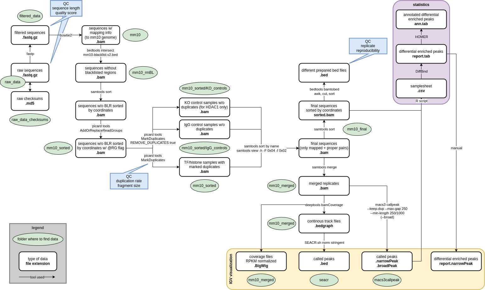

# Publication: "HDAC1 controls the generation and maintenance of effector-like CD8+ T cells during chronic viral infection"

This README gives an overview of all R scripts used for analysis and visualization of scRNA-Seq, ATAC-Seq, and CUT&RUN data in the study (<em>Journal of Experimental Medicine</em>, DOI: https://doi.org/10.1084/jem.20240829). They are available from the respective subfolders in this repository. The raw and processed data used as input are available in the GEO database. Additionally, relevant metadata generated within the study can be found in the corresponding subfolder, including QC plots. Seurat objects (.rds files) have not been uploaded because of size restrictions. Rerunning the analysis may result in slightly different results due to the nature of probability based functions used. 

For any questions or comments on the provided scripts and metadata please use the Discussions panel.

## Contents
- [scRNA-Seq Analysis](#scrna-seq-analysis)
- [ATAC-Seq Analysis](#atac-seq-analysis)
- [Integration of scRNA-Seq and ATAC-Seq Analysis](#integration-of-scrna-seq-and-atac-seq-analysis)
- [CUT&RUN Analysis](#cutrun-analysis)

## scRNA-Seq Analysis

Raw sequencing output was processed to count-feature-barcode matrices as described in the methods section of the publication. Here only the subsequently used R scripts are described and made available. They are split in logically connected units to make versatile usage as easy as possible.

Large parts of the scripts are based on the tutorials provided by the Satija lab and the tutorial from HBC training: 

* https://satijalab.org/seurat/articles/pbmc3k_tutorial.html
* https://hbctraining.github.io/scRNA-seq_online/schedule/links-to-lessons.html

#### 01_scRNAseq_QC_cells.R

R script to run the cell-based quality control of scRNA-Seq data using the Seurat package. As input the path to the directory containing Cell Ranger output (raw count matrix with corresponding feature and barcode lists) has to be specified. The script will read in the data, convert it to a Seurat object, demultiplex and assign the HTO identities, remove doublets and negatives, remove unwanted cell types, add sample identifiers, rename some metadata columns, and visualize the QC metrics of the raw singlet data. Finally, the updated Seurat object will be saved.

Output files: 

* DemuxRidgePlot.pdf
* DemuxClassificationGlobalPlot.pdf
* DemuxHeatmapPlot.pdf
* TableCellTypesPredictedRaw.csv
* RawViolinMetadataQC.pdf
* RawNCellsReps.pdf
* RawQCmetrics.pdf
* RawQC_UMIGenesMitoCorr.pdf
* cd8t_demux_s.rds

#### 02_scRNAseq_QC_genes.R

R script to run the gene-based quality control of scRNA-Seq data using the Seurat package. As input the Seurat object resulting from script 01_scRNAseq_QC_cells.R is required. The data will be filtered by the number of detected UMIs, genes, complexity and % of mitochondrial genes. The same QC metrics as for the raw data will be visualized for the filtered data. The filtered Seurat object will be saved.

Output files: 

* FiltViolinMetadataQC.pdf
* FiltNCellsReps.pdf
* FiltQCmetrics.pdf
* FiltQC_UMIGenesMitoCorr.pdf
* filtered_cd8t.rds

#### 03_scRNAseq_QC_regression_integration.R

R script to regress out unwanted variation from cell cycle phases and to integrate the replicates. PCA and UMAP before and after regression will be visualized. As input the Seurat object resulting from script 02_scRNAseq_QC_genes.R is required. The final Seurat object will again be saved.

Output files: 

* CellCyclePCAbeforeReg.pdf
* ReplicatesUMAPbeforeInt.pdf
* CellCyclePCAafterReg.pdf
* ReplicatesUMAPafterInt.pdf
* cd8t_integrated.rds

#### 04_scRNAseq_Clustering.R

R script to determine the number of principal components to use and to perform the clustering with different resolutions. Requires the Seurat object generated in the script 03_scRNAseq_QC_regression_integration.R as input. All clusterings will be saved within the resulting Seurat object.

Output files: 

* EllbowPCstoUse.pdf
* cd8t_cluster.rds

#### 05_scRNAseq_Clustering_characterization.R

R script to characterize clusters. This is done by calulating module scores from published signature gene sets and finding marker gene sets. Annotation is done manually guided by those results. Requires the Seurat object generated in the script 04_scRNAseq_Clustering.R and a CSV file containing published gene signatures (Daniel2021_TcellSignatures.csv) as input. A Seurat object containing the annotated cluster names as metadata will be saved. Additionally, several plots characterizing the clusters in regard to their marker genes and frequencies are output.

Output files: 

* FeaturePlot_ClusterComparedtoDanieletal_Res.0.6.pdf
* DotPlot_ClusterComparedtoDanieletal_Res.0.6.pdf
* Allmarkers_default_Res.0.6.csv
* UMAP_ALL_Res0.6.pdf
* UMAP_ALLsplit_Res0.6.pdf
* cd8t_cluster_ownIdentsRes0.6.rds
* CellNumberBarplot_Res0.6.pdf
* FrequencyBarplot_Res0.6.pdf
* Alluniquemarkers_Res.0.6.csv
* Heatmap_Alluniquemarkers_Res.0.6.pdf
* FeaturePlots_GenesofInterest.pdf

#### 06_scRNAseq_Clustering_analysis.R

R script to run differential expression analysis and GO term enrichment analysis. Requires the Seurat object and marker gene list generated in the script 05_scRNAseq_Clustering_characterization.R as input. Differentially expressed genes between KO and WT in early-non-Texprog are output as CSV as well as Volcano Plot. Enriched GO terms are output as CSV file and reduced using the web-based tool Revigo (http://revigo.irb.hr/). Those terms are read back in (file: Revigo_BP_Table_ALLclustersRes0.6_AllSignMarkers_Top10.tsv) and plotted as dotplot for all clusters.

Output files: 

* nonTexprogDEGs.csv
* VolcanoPlot_KOvsWT_earlynonTexprog_Res0.6.pdf
* GOBPenriched_DotplotData_ALLclustersRes0.6_AllSignMarkers.csv
* GOBPenriched_DotPlotData_ALLclustersRes0.6_AllSignMarkers_Top10forRevigo.txt
* GOBPenriched_DotPlot_ALLclustersRes0.6.pdf

#### 07_scRNAseq_Trajectory.R

R script to run trajectory inference analysis with Monocle3 on the data stored in the Seurat object. Requires the Seurat object generated in the script 05_scRNAseq_Clustering_characterization.R as input. The trajectory is plotted on top of the UMAP of the clusters colored by pseudotime.

Output file: 

* Plot_Trajectory_Monocle3_Pseudotime.pdf

#### 08_scRNAseq_SCENIC.R

R script to run regulatory network analysis with SCENIC on the data stored in the Seurat object. Requires the Seurat object generated in the script 05_scRNAseq_Clustering_characterization.R as input. The results are plotted as dotplots showing regulon activities. The scripts 08a_scRNAseq_SCENIC.R and 08b_scRNAseq_SCENIC.R need to be run on a server with enough RAM and are therefore saved separately. The resulting file of 08b_scRNAseq_SCENIC.R is used again as input here to then generate the visualizations.

Output files: 

* exprMat.tab
* cellInfo.tab
* colVars.tab
* motifAnno.tab
* scenicOptions.tab
* exprMat_filtered.tab
* DotPlot_RegulonActivity_TexProg_WT_vs_KO.pdf
* DotPlot_RegulonActivity_nonTexProg_WT_vs_KO.pdf

#### 08a_scRNAseq_SCENIC.R

R script to run GENIE3 as first step of SCENIC to infer potential TF targets based on the expression data. Requires motifAnno.tab, scenicOptions.Rds and exprMat_filtered.tab generated in the script 08_scRNAseq_SCENIC.R as input. Creates several output files, which are not uploaded or described here due to size restrictions. Only the one file, which is used for further analysis is listed here.

Output files: 

* scenicOptions_afterGenie.Rds

#### 08b_scRNAseq_SCENIC.R

R script to actually run SCENIC in three steps. Requires exprMat.tab and motifAnno.tab generated in the script 08_scRNAseq_SCENIC.R and scenicOptions_afterGenie.Rds generated in the script 08a_scRNAseq_SCENIC.R as input. Creates several output files, which are not uploaded or described here due to size restrictions. Only the one file, which is used for further analysis is listed here.

Output files: 

* scenicOptions_afterRunSCENIC_3.Rds

## ATAC-Seq Analysis

Raw sequencing output was processed to a consensus sequence count matrix as described in the methods section of the publication. Here only the subsequently used R scripts are described and made available.

#### 01_ATACseq_QC.R

R script to run quality control on consensus region count matrix and normalize counts. Requires count matrix of all consensus regions, consensus region annotations and sample annotations as input. Outputs different QC plots, the count matrix including normalized counts and the default DESeq2 object as RDS.

Output files: 

* PeakMeansSDs_all.pdf
* PeakMeansSDs_woout.pdf
* BoxplotCountsBeforeNorm.pdf
* BoxplotCountsAfterNorm.pdf
* dfATACcountswithinfosandnormalization.csv
* PCAgroup.pdf
* ATACseq_dds.rds

#### 02_ATACseq_DifferentiallyAccessibleRegions.R

R script to find differentially accessible regions and annotate their position. Requires default DESeq2 object generated in script 02_ATACseq_DifferentiallyAccessibleRegions.R as input. Outputs count matrix with calculated significances added, tables of significant DARs in both groups, annotation plots of both groups, and number of significant DARs in all groups as barplot.

Output files: 

* dfATACcountswithsignificances.csv
* dfATAC_Texprog_significantDARs.csv
* dfATAC_nonTexprog_significantDARs.csv
* Texprog_signDARsKOvsWT_annotation.pdf
* nonTexprog_signDARsKOvsWT_annotation.pdf
* DARs_numberDARsGenotypes.pdf

#### 03_ATACseq_GeneSetEnrichmentAnalysis.R

R script to analyse enrichment of significant DARs in GO terms of Biological Processes (BP) and compared to effector like gene sets from the ImmuneSigDb. Requires CSV files with significant DARs and count matrix from script 02_ATACseq_DifferentiallyAccessibleRegions.R as input. Outputs tables and plots of enriched GO terms (BP) as well as enriched ImmuneSigDb signatures.

Output files: 

* GOBPenriched_allTerms.csv
* GOBPenriched_allTerms_Top10forRevigo.txt
* GOBPenriched_all_Revigo.tsv
* DotPlot_GOBPenriched_signDARs.pdf
* GSEA_EnrichmentPlot_ImmuneSigDb_CD8TcellEffectorExhausted_DARs.pdf
* GSEA_EnrichmentPlot_ExhaustedSignature_DARs.pdf
* GSEA_EnrichmentPlot_EffectorSignature_DARs.pdf
* GSEA_EnrichmentPlot_Table.csv

#### 04_ATACseq_TFmotifs_GetConsensusBedFilesOfInterest.R

R script to prepare files containing consensus regions of interest for later usage with HOMER. Requires consensus.bed file with all detected consensus regions and CSV files with significant DARs from script 02_ATACseq_DifferentiallyAccessibleRegions.R as input. Outputs separate BED files for celltype and genotype containing consensus regions detected as DARs in previous analyses.

Output files: 

* TprogWTopenCons.bed
* TprogKOopenCons.bed
* TtermWTopenCons.bed
* TtermKOopenCons.bed

## Integration of scRNA-Seq and ATAC-Seq Analysis

R script to integrate the ATAC-Seq data with the scRNA-Seq data by calculating module scores of the significant DARs of interest and projecting them on the UMAPs. Requires the Seurat object generated in the script 05_scRNAseq_Clustering_characterization.R as well as the files dfATAC_Texprog_significantDARs.csv and dfATAC_nonTexprog_significantDARs.csv generated in the script 02_ATACseq_DifferentiallyAccessibleRegions.R as input. Outputs the expression of the calculated module scores of the significant DARs in each cell on the clustering (UMAP) of the scRNA-Seq analysis. Also outputs violin plots showing the module score distributions in each cluster and a table with corresponding statistics results.

Output files: 

* TprogDARsOnCluster.pdf
* TtermDARsOnCluster.pdf
* TprogDARsModuleScores_scRNACluster.pdf
* TtermDARsModuleScores_scRNACluster.pdf
* WTTprogDARs_ModuleScores_AnovaTukeyResults.txt
* KOTprogDARs_ModuleScores_AnovaTukeyResults.txt
* WTTtermDARs_ModuleScores_AnovaTukeyResults.txt
* KOTtermDARs_ModuleScores_AnovaTukeyResults.txt

## CUT&RUN Analysis

Raw sequencing output was processed to coverage and peak files as described in the methods section of the publication. Here only the subsequently used scripts for quality control and analysis are described and made available.

The complete workflow:

